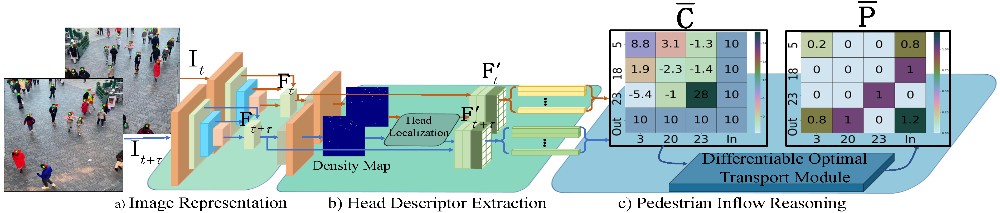
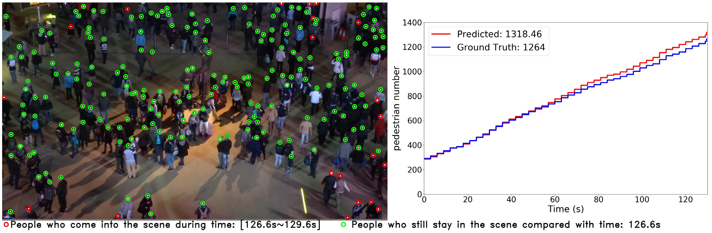

# DRNet for  Video Indvidual Counting (CVPR 2022)
## Introduction
This is the official PyTorch implementation of paper: [**DR.VIC: Decomposition and Reasoning for Video Individual Counting**](https://arxiv.org/abs/2203.12335). Different from the single image counting methods, it counts the total number of the pedestrians in a video sequence with a person in different frames only being calculated once. DRNet decomposes this new task to estimate the initial crowd number in the first frame and integrate differential crowd numbers in a set of following image pairs (namely current frame and preceding frame). 


# Catalog
- [x] Testing Code (2022.3.19)
- [x] PyTorch pretrained models (2022.3.19)
- [x] Training Code 
  - [x] HT21 
  - [x] SenseCrowd (2022.9.30

# Getting started 

## preparatoin 

- Clone this repo in the directory (```Root/DRNet```):
- Install dependencies. We use python 3.7 and pytorch >= 1.6.0 : http://pytorch.org.

    ```bash
    conda create -n DRNet python=3.7
    conda activate DRNet
    conda install pytorch==1.7.0 torchvision==0.8.0 cudatoolkit=10.2 -c pytorch
    cd ${DRNet}
    pip install -r requirements.txt
    ```

-  [PreciseRoIPooling](https://github.com/vacancy/PreciseRoIPooling) for extracting the feature descriptors

      Note: the PreciseRoIPooling [1] module is included in the repo, but it's likely to have some problems when running the code: 

      1. If you are prompted to install ninja, the following commands will help you.  
            ```bash
            wget https://github.com/ninja-build/ninja/releases/download/v1.8.2/ninja-linux.zip
            sudo unzip ninja-linux.zip -d /usr/local/bin/
            sudo update-alternatives --install /usr/bin/ninja ninja /usr/local/bin/ninja 1 --force 
            ```
      2. If you encounter errors when compiling the PreciseRoIPooling, you can look up the original repo's [issues](https://github.com/vacancy/PreciseRoIPooling/issues) for help. One solution to the most common errors can be found in this [blog](https://blog.csdn.net/weixin_42098198/article/details/124756432?spm=1001.2014.3001.5502).
- Datasets 
   - **HT21** dataset: Download CroHD dataset from this [link](https://motchallenge.net/data/Head_Tracking_21/). Unzip ```HT21.zip``` and place ``` HT21``` into the folder (```Root/dataset/```). 
   - **SenseCrowd** dataset: Download the dataset from [Baidu disk](https://pan.baidu.com/s/1dZKvMLZ58ekFhPcKPTK4pQ?pwd=48oi) or from the original dataset [link](https://github.com/HopLee6/VSCrowd-Dataset). 
   - Download the lists of `train/val/test` sets at [link1](https://1drv.ms/u/s!AgKz_E1uf260nWeqa86-o9FMIqMt?e=0scDuw) or [link2](https://pan.baidu.com/s/13X3-egn0fYSd6NUTxB4cuw?pwd=ew8f), and place them to each dataset folder, respectively.   
## Training
Check some parameters in ```config.py``` before training,
* Use `__C.DATASET = 'HT21'` to set the dataset (default: `HT21`).
* Use `__C.GPU_ID = '0'` to set the GPU.
* Use `__C.MAX_EPOCH = 20` to set the number of the training epochs (default:20).
* Use `__C.EXP_PATH = os.path.join('./exp', __C.DATASET)` to set the dictionary for saving the code, weights, and resume point.

Check other parameters (`TRAIN_BATCH_SIZE`, `TRAIN_SIZE` etc.) in the ```Root/DRNet/datasets/setting``` in case your GPU's memory is not support for the default setting.
- run ```python train.py```.

 
Tips: The training process takes **~10 hours** on HT21 dataset with **one TITAN RTX (24GB Memory)**. 

## Testing
To reproduce the performance, download the pre-trained models from [onedrive](https://1drv.ms/u/s!AgKz_E1uf260nWeqa86-o9FMIqMt?e=0scDuw) or [badu disk](https://pan.baidu.com/s/1cMB4p-Z-55t4DEdjfz18zg?pwd=aacv) and then place  ```pretrained_models``` folder to ```Root/DRNet/model/``` 
- for HT21:                                                    
  - Run ```python test_HT21.py```.
- for SenseCrowd:  
  - Run ```python test_SENSE.py```.
Then the output file (```*_SENSE_cnt.py```) will be generated.
## Performance 
The results on HT21 and SenseCrowd.

- HT21 dataset

|   Method   |  CroHD11~CroHD15    |  MAE/MSE/MRAE(%)  |
|------------|-------- |-------|
| Paper:  VGG+FPN [2,3]| 164.6/1075.5/752.8/784.5/382.3|141.1/192.3/27.4|
| This Repo's Reproduction:  VGG+FPN [2,3]|138.4/1017.5/623.9/659.8/348.5|160.7/217.3/25.1| 

- SenseCrowd dataset

|   Method   |  MAE/MSE/MRAE(%)|  MIAE/MOAE | D0~D4 (for MAE)  |
|------------|---------|-------|-------|
| Paper:  VGG+FPN [2,3]| 12.3/24.7/12.7 |1.98/2.01 |4.1/8.0/23.3/50.0/77.0| 
| This Repo's Reproduction:  VGG+FPN [2,3] |  11.7/24.6/11.7 | 1.99/1.88| 3.6/6.8/22.4/42.6/85.2 |

# Video Demo
Please visit [bilibili](https://www.bilibili.com/video/BV1cY411H7hr/) or [YouTube]() to watch the video demonstration.

# References
1. Acquisition of Localization Confidence for Accurate Object Detection, ECCV, 2018.
2. Very Deep Convolutional Networks for Large-scale Image Recognition, arXiv, 2014.
3. Feature Pyramid Networks for Object Detection, CVPR, 2017. 

# Citation
If you find this project is useful for your research, please cite:
```
@article{han2022drvic,
  title={DR.VIC: Decomposition and Reasoning for Video Individual Counting},
  author={Han, Tao, Bai Lei, Gao, Junyu, Qi Wang, and Ouyang  Wanli},
  booktitle={CVPR},
  year={2022}
}
```

# Acknowledgement
The released PyTorch training script borrows some codes from the [C^3 Framework](https://github.com/gjy3035/C-3-Framework) and [SuperGlue](https://github.com/magicleap/SuperGluePretrainedNetwork) repositories. If you think this repo is helpful for your research, please consider cite them. 
